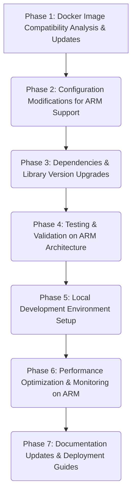

# ARM Migration: Development Plan and Modernization Strategy

## 1. Project Overview

### Current State of the Legacy Project
*   **Project Name:** [Specify Project Name]
*   **Description:** [Briefly describe the project's purpose and domain]
*   **Technologies Used (based on workspace analysis and assumptions):**
    *   **Backend:** Go (multiple microservices: e.g., chats, counters, posts, users, web API)
    *   **Inter-service Communication:** gRPC (inferred from `.proto` files)
    *   **Frontend:** HTML, CSS, JavaScript (served by Go web service)
    *   **Databases:** MySQL, Tarantool (inferred from Docker setup)
    *   **Messaging/Real-time:** Centrifugo (inferred from Docker setup)
    *   **Proxying/Load Balancing:** HAProxy (inferred from Docker setup), ProxySQL (inferred from Docker setup)
    *   **Monitoring:** Prometheus (inferred from Docker setup)
    *   **Containerization:** Docker (inferred from `Dockerfile`, `docker-compose.yml`)
    *   **Build System:** `Makefile` (present in workspace)
*   **Architecture (based on workspace analysis and assumptions):**
    *   Microservices architecture.
    *   Likely event-driven components with services like Centrifugo.
    *   Stateful services (databases) and stateless application services.
*   **Scale:**
    *   Current user base: [Specify number of active users, e.g., 10k DAU]
    *   Transaction volume: [Specify, e.g., 100 QPS average, peak QPS]
    *   Data size: [Specify, e.g., TBs of data in MySQL]
    *   Number of services: [Specify, e.g., ~5-10 core microservices, based on `services/` directory]
*   **Deployment Environment:** [Specify current deployment environment, e.g., on-premise x86 servers, specific cloud provider VMs]

### Technical Constraints
*   **Budget:** [Specify budget allocated for the migration project, if any]
*   **Timeline:** [Specify desired or mandated timeline for completion, e.g., 6 months, Q4]
*   **Existing Infrastructure:**
    *   [Describe relevant existing infrastructure that might be leveraged or needs integration, e.g., CI/CD systems, monitoring dashboards]
    *   Connectivity to other systems: [Specify any dependencies on systems not being migrated]
*   **Team Skills:**
    *   Current team expertise with Go: [Specify level, e.g., proficient, intermediate]
    *   Current team expertise with Docker: [Specify level]
    *   Current team expertise with ARM architecture: [Specify level, e.g., novice, some experience]
    *   Availability of training resources: [Yes/No, or specify]
*   **Regulatory/Compliance Requirements:** [Specify any that impact technology choices or data handling on ARM]

### Target ARM-based Architecture
*   **Specific ARM Processors:** [Specify, e.g., AWS Graviton3, Ampere Altra, Raspberry Pi 4 for specific use cases] or general (e.g., `arm64v8` compatible)
*   **Cloud Platforms:** [Specify, e.g., AWS EC2 ARM instances, Azure ARM VMs, Google Cloud Tau T2A VMs]
*   **On-Premise Solutions:** [Specify if targeting on-premise ARM servers, e.g., specific vendor hardware]
*   **Operating System:** [Specify target OS on ARM, e.g., Ubuntu 22.04 LTS for ARM, Amazon Linux 2023 for ARM]
*   **Container Orchestration (if applicable):** [Specify, e.g., Kubernetes on ARM, Docker Swarm on ARM]

## 2. Requirements, Dependencies, and Technical Assumptions

### Functional and Non-Functional Requirements
*   **Functional Requirements (FRs):**
    *   The modernized system running on ARM must retain 100% feature parity with the existing x86-based system.
    *   All existing APIs and user interfaces must function identically.
    *   Data integrity and consistency must be maintained throughout and after migration.
    *   [Add any new functional requirements specific to the ARM migration, if any]
*   **Non-Functional Requirements (NFRs) on ARM:**
    *   **Performance:**
        *   Response times for key APIs must be within [X]% of current x86 performance, or meet [Y ms P95] target.
        *   System throughput must support [current peak QPS + Z% growth] on ARM.
    *   **Scalability:** The system must be ableable to scale horizontally on ARM-based infrastructure to handle [N]% future load increase.
    *   **Reliability:** Achieve [e.g., 99.95%] uptime on the ARM platform. Error rates must not exceed [X]%.
    *   **Security:** Maintain or enhance current security posture. All security mechanisms (authentication, authorization, data encryption) must be fully functional on ARM. ARM-specific security features should be leveraged if applicable.
    *   **Maintainability:** Codebase and infrastructure should be easily maintainable on ARM. Standardized logging, monitoring, and alerting.
    *   **Cost-efficiency:** The migration aims to [e.g., reduce infrastructure costs by X% by leveraging ARM's price/performance].
    *   **Compatibility:** Ensure compatibility with existing client applications and integrated third-party services.

### Dependencies
*   **Operating Systems:**
    *   Development: [Specify OS used by developers, e.g., macOS (with emulation), Linux x86]
    *   Build/CI: [Specify OS, e.g., Linux x86, transitioning to ARM-based runners]
    *   Production (Target): [e.g., Ubuntu 22.04 LTS (arm64v8), Amazon Linux 2023 (arm64v8)]
*   **Compilers/Toolchains:**
    *   Go: [Specify version, e.g., Go 1.2x, ensure ARM64 target support (`GOARCH=arm64`)]
    *   C/C++ compilers (for cgo or system libraries): [e.g., GCC, Clang with ARM support]
*   **Key Software Libraries & Frameworks (from `go.mod`, `go.sum`, and service logic):**
    *   [List major Go dependencies, e.g., gRPC, Gin/Echo (if used for web), database drivers, client libraries for external services. Check `go.mod` for specifics.]
    *   Crucial: All libraries must have ARM64-compatible versions or alternatives.
*   **External Services & Databases (versions from `docker-compose.yml` or current deployment):**
    *   MySQL: [Specify version, e.g., 8.0.x] - ARM64 compatible image required.
    *   Tarantool: [Specify version] - ARM64 compatible image/build required.
    *   Centrifugo: [Specify version] - ARM64 compatible image required.
    *   Prometheus: [Specify version] - ARM64 compatible image required.
    *   HAProxy: [Specify version] - ARM64 compatible image/build required.
    *   ProxySQL: [Specify version] - ARM64 compatible image/build required.
*   **Runtime Environments:**
    *   Docker Engine: [Specify version, ensure ARM support]
    *   Container Orchestrator (if used): [e.g., Kubernetes version, ensure ARM node support]
*   **Hardware Dependencies (Target Environment):**
    *   Specific ARM CPU features relied upon (if any): [e.g., NEON, SVE] - unlikely for this project but good to note.
    *   Minimum RAM/CPU core requirements per instance on ARM.

### Technical Assumptions
*   **Availability of ARM-compatible Software:**
    *   All critical base Docker images (e.g., for Go, Alpine, Ubuntu, MySQL, Prometheus, etc.) have stable `arm64v8` (or multi-arch) versions.
    *   All key Go libraries and dependencies are either platform-agnostic or provide ARM64 builds.
    *   Third-party services (e.g., payment gateways, external APIs) accessed by the application are not affected by the server-side architecture change.
*   **Performance Characteristics:**
    *   ARM architecture will provide comparable or better performance per dollar for the project's workloads.
    *   Any performance regressions identified can be mitigated through code optimization or configuration changes.
*   **Tooling and Ecosystem:**
    *   Development tools (IDE, debuggers, linters) for Go work effectively for ARM targets (either natively or via emulation/cross-compilation).
    *   CI/CD systems can be configured to build and test for ARM64 architecture.
    *   Monitoring and logging tools are compatible with ARM environments.
*   **Migration Feasibility:**
    *   The existing codebase (primarily Go) is largely portable to ARM64 with minimal changes (Go's cross-compilation capabilities are a strong point here).
    *   Any x86-specific assembly code or cgo dependencies can be refactored or have ARM-compatible counterparts. (Review [`Makefile`](Makefile:1) and build scripts for any such indications).
*   **Team Adaptation:** The development team can adapt to any new workflows or tools required for ARM development and deployment within the project timeline.

## 3. Structured, Phased Development Checklist

This checklist outlines the key phases for migrating the project to ARM-based environments.

---

### Phase 1: Docker Image Compatibility Analysis and Required Updates

*   **Description:** Analyze existing Docker images for ARM compatibility, identify base images needing replacement (e.g., `amd64/` to `arm64v8/` or multi-arch images), and outline steps for rebuilding or updating Dockerfiles.
*   **Key Files to Review:** Root [`Dockerfile`](Dockerfile:1), [`docker-compose.yml`](docker-compose.yml:1), [`docker/prometheus/Dockerfile`](docker/prometheus/Dockerfile:1), [`docker/proxysql/Dockerfile`](docker/proxysql/Dockerfile:1), [`docker/tarantool/Dockerfile`](docker/tarantool/Dockerfile:1), [`docker/web/Dockerfile`](docker/web/Dockerfile:1), and any other custom Dockerfiles.
*   **Success Criteria:**
    *   All Docker images used by the project successfully build and run on an `arm64v8` architecture.
    *   A comprehensive list of all Docker images, their original architecture, and their new ARM-compatible counterparts (or multi-arch tags) is documented.
    *   All `Dockerfiles` are updated to use ARM-compatible base images (e.g., `arm64v8/golang`, `arm64v8/mysql`) or multi-arch images.
    *   `docker-compose.yml` is updated to specify ARM or multi-arch images where necessary.
*   **Potential Risks:**
    *   Some base images may not have official `arm64v8` support.
    *   Custom-built images might rely on x86-specific binaries or build steps.
    *   Performance issues with emulated x86 images if used as a temporary workaround.
    *   Increased build times for multi-arch images.
*   **Mitigation Strategies:**
    *   Prioritize official multi-arch images or `arm64v8`-specific tags.
    *   If official ARM images are unavailable, explore community-supported images or plan to build custom ARM base images.
    *   For x86-specific binaries in custom images, find ARM alternatives or recompile from source for ARM.
    *   Utilize native ARM builders in CI/CD to speed up build times.
*   **Testing Requirements:**
    *   **Build Tests:** Verify all Docker images build successfully on an ARM64 platform (or cross-build for ARM64).
    *   **Runtime Tests:** Deploy containers from new images on an ARM64 host/emulator and perform basic smoke tests to ensure services start and are responsive.
    *   **Compatibility Tests:** Ensure that services running in ARM containers can communicate with each other as expected.

---

### Phase 2: Configuration Modifications Needed for ARM Support

*   **Description:** Identify configuration files (e.g., deployment scripts, CI/CD pipelines, service configurations) requiring changes for ARM and detail necessary modifications.
*   **Key Files/Systems to Review:** [`Makefile`](Makefile:1), CI/CD pipeline configurations (e.g., GitHub Actions, Jenkinsfile), deployment scripts (Bash, Python, etc.), service configuration files (e.g., [`docker/centrifugo/config.json`](docker/centrifugo/config.json:1), [`docker/haproxy/haproxy.cfg`](docker/haproxy/haproxy.cfg:1), [`docker/mysql/*.cnf`](docker/mysql/slave1.cnf:1), [`docker/prometheus/prometheus.yml`](docker/prometheus/prometheus.yml:1), [`docker/proxysql/proxysql.cnf`](docker/proxysql/proxysql.cnf:1), various `services/**/config.go` files if they contain arch-specific paths or settings).
*   **Success Criteria:**
    *   All relevant configuration files and scripts are updated to support ARM64 deployment and operation.
    *   CI/CD pipelines are configured to build, test, and deploy for ARM64 targets.
    *   Deployment scripts correctly target ARM environments and use appropriate architecture flags.
    *   Service configurations are validated for ARM (e.g., no hardcoded x86 paths or settings).
*   **Potential Risks:**
    *   Hardcoded architecture assumptions in scripts or configuration files.
    *   CI/CD tooling may lack mature ARM support or require significant reconfiguration.
    *   Environment-specific configurations might be overlooked.
*   **Mitigation Strategies:**
    *   Thoroughly audit all scripts and configuration files for architecture-specific settings. Use variables for architecture flags.
    *   Research and select CI/CD runners/tools with good ARM support (e.g., native ARM runners, Docker Buildx for multi-arch builds).
    *   Implement a configuration management strategy that handles platform differences gracefully.
    *   Version control all configuration changes.
*   **Testing Requirements:**
    *   **CI/CD Pipeline Tests:** Full pipeline execution (build, test, deploy) targeting an ARM environment.
    *   **Deployment Tests:** Successful deployment to a staging/test ARM environment using updated scripts.
    *   **Configuration Validation:** Verify services start and run correctly with updated configurations on ARM.

---

### Phase 3: Dependencies and Library Version Upgrades

*   **Description:** Audit all project dependencies (programming language libraries, third-party tools) for ARM compatibility. Identify libraries requiring updates or replacement. Plan for version upgrades, noting potential breaking changes.
*   **Key Files to Review:** [`go.mod`](go.mod:1), [`go.sum`](go.sum:1), any vendor directories, documentation for third-party tools.
*   **Success Criteria:**
    *   All Go dependencies are confirmed to be ARM64 compatible or have ARM64 compatible alternatives.
    *   A compatibility matrix for all key dependencies (Go libraries, system tools) is created, noting current version, target ARM-compatible version, and any known issues or migration notes.
    *   Necessary library upgrades are performed and tested.
    *   The project successfully compiles (`go build ./...`) and all unit/integration tests pass when targeting `GOOS=linux GOARCH=arm64`.
*   **Potential Risks:**
    *   Critical libraries may lack ARM64 support or have unstable ARM versions.
    *   Version upgrades might introduce breaking changes or regressions.
    *   Hidden dependencies (e.g., C libraries via cgo) might have ARM compatibility issues.
    *   Time-consuming process if many libraries need updates or replacements.
*   **Mitigation Strategies:**
    *   Prioritize libraries with official ARM64 support.
    *   If a library is incompatible, search for forks, alternatives, or consider contributing ARM support upstream.
    *   Address breaking changes from version upgrades incrementally.
    *   Thoroughly investigate any cgo dependencies using `go list -f '{{.CgoFiles}}' ./...` and ensure cross-compilers and ARM libraries are available.
    *   Allocate sufficient time for dependency audit and upgrades.
*   **Testing Requirements:**
    *   **Compilation Tests:** Successful cross-compilation of all Go services for `linux/arm64`.
    *   **Unit Tests:** All existing unit tests must pass when run against ARM-compiled binaries (either natively on ARM or emulated).
    *   **Integration Tests:** Key integration tests must pass in an ARM environment.
    *   **Dependency Scanning:** Use tools like `nancy` (for Go) or Snyk/Dependabot to identify vulnerabilities in new versions.
    *   **Compatibility Matrix (Example Snippet):**
        | Dependency Name | Current Version (x86) | Target Version (ARM64) | ARM64 Support | Notes / Breaking Changes |
        |-----------------|-----------------------|------------------------|-----------------|--------------------------|
        | `github.com/gin-gonic/gin` | `v1.7.0`              | `v1.9.1` or latest     | Yes (pure Go)   | Review release notes     |
        | `mysql-driver`  | `[version]`           | `[latest_arm_compat]`  | Check           | Test thoroughly          |
        | `[cgo_dependency]`| `[version]`           | `[version_or_alt]`     | Requires investigation | Potential build complexity |

---

### Phase 4: Testing and Validation on ARM Architecture

*   **Description:** Establish an ARM-based testing environment. Define a comprehensive testing strategy covering functional, performance, and compatibility aspects. Specify tools and methodologies for ARM-specific testing.
*   **Success Criteria:**
    *   A dedicated ARM-based (or accurately emulated) testing environment is operational.
    *   A comprehensive test plan for ARM is documented and approved.
    *   All functional tests pass on the ARM environment, achieving feature parity.
    *   Performance benchmarks on ARM meet the defined NFRs.
    *   Compatibility with external systems and clients is validated from the ARM environment.
*   **Potential Risks:**
    *   Differences in behavior between x86 and ARM for certain edge cases (e.g., floating-point precision, unaligned memory access if using Cgo).
    *   Performance bottlenecks unique to ARM architecture.
    *   Inadequate test coverage for ARM-specific issues.
    *   Difficulty in replicating production ARM environment for testing.
*   **Mitigation Strategies:**
    *   Use native ARM hardware for testing where possible (e.g., cloud ARM instances, ARM dev boards).
    *   Develop specific tests for known ARM pitfalls if Cgo or low-level code is involved.
    *   Employ thorough performance profiling tools on ARM.
    *   Augment existing test suites with ARM-specific scenarios.
    *   Ensure staging environment closely mirrors production ARM setup.
*   **Testing Requirements:**
    *   **Functional Testing:** Full regression suite execution on ARM.
    *   **Integration Testing:** End-to-end tests across microservices on ARM.
    *   **Performance Testing:** Load testing, stress testing, and soak testing on ARM to identify bottlenecks and measure against NFRs. Tools: k6, JMeter, Go's `pprof`.
    *   **Compatibility Testing:** Test interactions with all external services, databases, and client applications from the ARM environment.
    *   **Failover and Resilience Testing:** If applicable, test clustering and failover mechanisms on ARM.
    *   **Security Testing:** Penetration testing and vulnerability scanning on the ARM deployment.

---

### Phase 5: Local Development Environment Setup

*   **Description:** Outline steps for setting up ARM-based or emulated local development environments for developers. Provide guidance on tools and configurations.
*   **Success Criteria:**
    *   Developers can efficiently build, run, and debug applications for ARM targets locally.
    *   Clear documentation for setting up ARM local development environments is available.
    *   Multiple options for local ARM development are evaluated and recommended (e.g., Docker Desktop with ARM emulation, QEMU, ARM-based VMs, native ARM hardware like M1/M2 Macs).
*   **Potential Risks:**
    *   Poor performance of emulated ARM environments on x86 developer machines.
    *   Complexity in setting up and maintaining emulated environments.
    *   Inconsistencies between emulated local environments and native ARM production.
    *   Tooling (debuggers, IDE integrations) might have limitations with emulated/cross-compiled ARM binaries.
*   **Mitigation Strategies:**
    *   Provide powerful enough developer machines if emulation is heavy.
    *   Encourage use of native ARM development machines (e.g., Apple Silicon Macs) where available.
    *   Use lightweight virtualization or container-based emulation (e.g., Docker Desktop's Rosetta integration or QEMU user-mode).
    *   Invest in cloud-based ARM development instances if local options are insufficient.
    *   Thoroughly test and document debugger and IDE integration for ARM development.
*   **Testing Requirements:**
    *   **Environment Setup Tests:** Developers can follow documentation to successfully set up their local ARM dev environment.
    *   **Build & Run Tests:** Developers can build and run individual services locally targeting ARM.
    *   **Debugging Tests:** Developers can successfully debug applications running in the local ARM environment.

---

### Phase 6: Performance Optimization and Monitoring on ARM

*   **Description:** Define strategies for identifying and addressing performance bottlenecks specific to ARM. Specify tools for performance profiling and monitoring on ARM. Set performance benchmarks and targets.
*   **Success Criteria:**
    *   The application meets or exceeds performance NFRs on ARM.
    *   A robust monitoring solution is in place for ARM environments, providing visibility into performance and resource utilization.
    *   Performance profiling tools and techniques for ARM are documented and used by the team.
    *   Key performance indicators (KPIs) and benchmarks are established and tracked.
*   **Potential Risks:**
    *   Unexpected performance regressions on ARM due to architectural differences (e.g., memory model, instruction set).
    *   Existing monitoring tools may not fully support ARM or provide ARM-specific metrics.
    *   Optimization techniques for x86 may not be effective or could be detrimental on ARM.
*   **Mitigation Strategies:**
    *   Use ARM-native profiling tools (e.g., Linux `perf`, Go `pprof` on ARM).
    *   Focus on Go-specific optimizations (e.g., reducing allocations, optimizing concurrency) which are generally platform-agnostic but can be re-validated on ARM.
    *   Consult ARM architecture performance guides.
    *   Ensure monitoring agents (e.g., Prometheus node exporter, cAdvisor) are ARM-compatible and collect relevant metrics.
    *   Iteratively profile, optimize, and measure.
*   **Testing Requirements:**
    *   **Profiling Sessions:** Regular profiling under load on ARM to identify hotspots.
    *   **Benchmarking:** Compare performance against established benchmarks and x86 performance.
    *   **A/B Testing (if applicable):** Compare performance of x86 and ARM versions under similar load.
    *   **Monitoring System Validation:** Ensure all critical metrics are collected and dashboards are functional for ARM environments.

---

### Phase 7: Documentation Updates and Deployment Guides

*   **Description:** Update all relevant project documentation (e.g., READMEs, developer guides, operations manuals) to reflect ARM support. Create or update deployment guides for ARM environments.
*   **Key Files to Update:** [`README.md`](README.md:1), any existing developer setup guides, operations runbooks, CI/CD documentation.
*   **Success Criteria:**
    *   All project documentation accurately reflects the support for ARM64 architecture.
    *   Developer onboarding documentation includes instructions for ARM development.
    *   Operations manuals and deployment guides are updated with specific instructions for ARM environments.
    *   Architectural diagrams are updated if necessary.
*   **Potential Risks:**
    *   Documentation updates are overlooked or incomplete.
    *   Outdated documentation leads to confusion or errors.
    *   Lack of ARM-specific operational knowledge transfer.
*   **Mitigation Strategies:**
    *   Assign clear responsibility for documentation updates.
    *   Integrate documentation updates into the definition of "done" for each phase.
    *   Conduct reviews of updated documentation.
    *   Hold training sessions for operations and development teams on ARM-specific aspects.
*   **Testing Requirements:**
    *   **Documentation Review:** Peer review of all updated documents for accuracy, clarity, and completeness.
    *   **Dry-Run Deployments:** Follow updated deployment guides to perform a test deployment to an ARM environment.
    *   **Developer Onboarding Test:** Have a new developer (or one unfamiliar with ARM setup) try to set up their environment using the updated guides.

---

This document serves as a foundational plan. It will require continuous refinement as the project progresses and more specific details emerge.